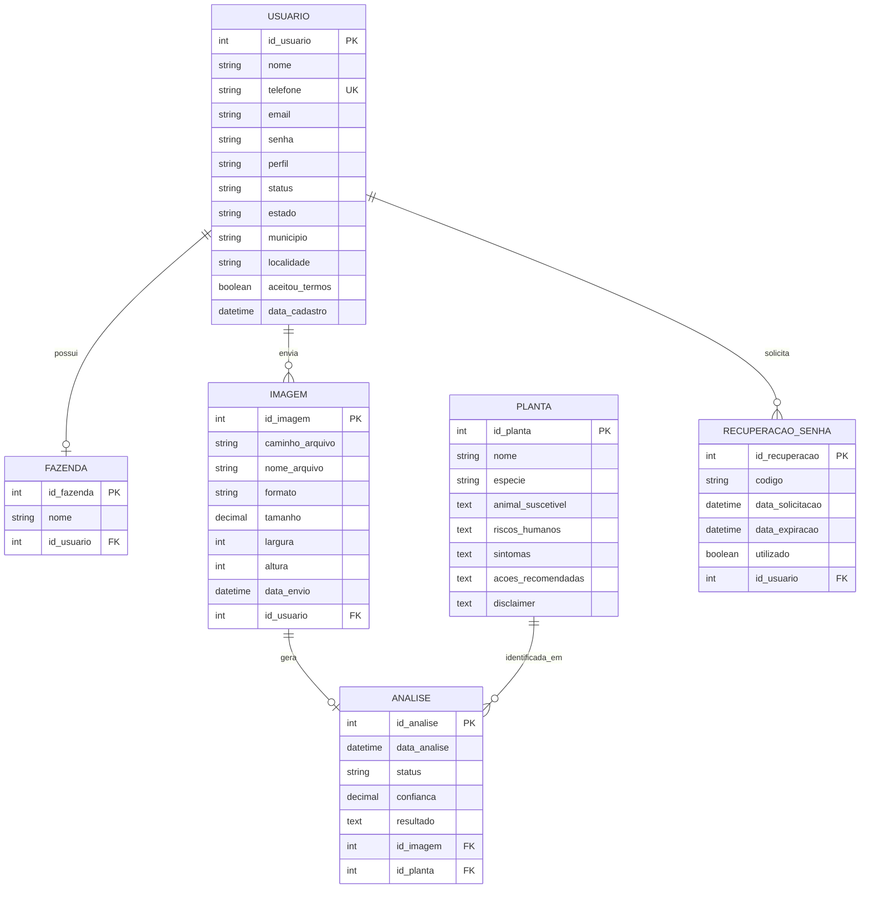

```mermaid
erDiagram

    USUARIO {
        int id_usuario PK
        string nome
        string telefone UK
        string email
        string senha
        string perfil
        string status
        string estado
        string municipio
        string localidade
        boolean aceitou_termos
        datetime data_cadastro
    }

    FAZENDA {
        int id_fazenda PK
        string nome
        int id_usuario FK
    }

    IMAGEM {
        int id_imagem PK
        string caminho_arquivo
        string nome_arquivo
        string formato
        decimal tamanho
        int largura
        int altura
        datetime data_envio
        int id_usuario FK
    }

    ANALISE {
        int id_analise PK
        datetime data_analise
        string status
        decimal confianca
        text resultado
        int id_imagem FK
        int id_planta FK
    }

    PLANTA {
        int id_planta PK
        string nome
        string especie
        text animal_suscetivel
        text riscos_humanos
        text sintomas
        text acoes_recomendadas
        text disclaimer
    }

    RECUPERACAO_SENHA {
        int id_recuperacao PK
        string codigo
        datetime data_solicitacao
        datetime data_expiracao
        boolean utilizado
        int id_usuario FK
    }

    USUARIO ||--o| FAZENDA : possui
    USUARIO ||--o{ IMAGEM : envia
    IMAGEM ||--o| ANALISE : gera
    PLANTA ||--o{ ANALISE : identificada_em
    USUARIO ||--o{ RECUPERACAO_SENHA : solicita
```
